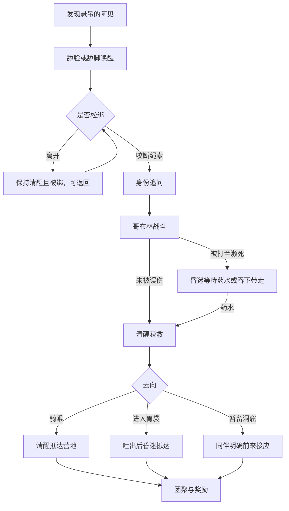

# 《我蛇了》第一章对白与旁白总稿

> 编辑稿 v0.2，2026-09-05。今后第一章的对白、旁白、选项文字和角色口吻统一在本文件维护。
> `[已实装]` 表示与 `prototype/story-data.js` 一致；`[制作人确认]` 表示已经拍板但可能尚未实装；`[AI补全·待审]` 表示为闭合分支而补写、等待制作人审阅。
> 原始洞窟稿归档于 `story/source/cave-v0.2.html`，不直接作为运行数据。

## 人物口吻基准

- **玩家**：直接、短句，能正常说话；饥饿失控时仍知道自己做了什么。
- **阿杰**：阿见的兄长，与丽丝是同行伙伴。冲动、好胜、保护欲强，习惯先拔剑再判断；关心别人时会用生硬或命令式说法掩饰。
- **丽丝**：阿杰和阿见的同行伙伴，不是他们的姐妹。冷静、善于观察和交涉，遇到危险会害怕，但通常最先照顾伤者并阻止冲突升级。
- **阿见**：受惊后谨慎、羞耻感强；获救前会因恐惧而防备，确认玩家没有恶意后会明显放软态度，只保留嘴硬和不服输的一面。
- **可蒂**：胆小、依赖感强，说话礼貌。

## 通用既定规则

1. 人物被吞下后进入胃袋；被吐出后持续昏迷，不能立刻对话。
2. 人物吐在荒野，玩家进入后续地图后，该人物死亡；吐在河边营地附近则存活并能在后续恢复。阿杰或丽丝有一人清醒返回营地时，会带上同一区域内昏迷的另一人；抵达营地后两人都恢复清醒。
3. 阿杰、丽丝两人都被消化后，永久失去“寻找阿见”任务；只剩一人时仍可接取或继续。
4. 相同互动的剧情奖励和状态只结算一次。食欲值的具体变化规则尚未确定，相关互动暂时只记录剧情结果。
5. 阿杰和丽丝不会收走吐出的铁剑；铁剑仍留在地图上，可由玩家重新吞入。
6. 剧情模式此前不出现黄色圆环，也不开放环形节点能力；洞窟祭坛是玩家第一次见到并获得黄色圆环。
7. 回复药水是消耗品；吐出后只要命中人物、玩家自己或墙壁便立刻碎裂，不能回收。
8. 金币建立为正式系统；食欲值转入 GDD 待办，本阶段不进入游戏实现。

## 第一章状态表

后续实现应读取状态组合生成台词，不为每一种组合复制整棵剧情树。

| 状态 | 可选值 |
|---|---|
| `find_ajian_quest` | `not_offered` / `declined` / `active` / `completed` / `failed` |
| `player_knows_ajian_name` | `true` / `false` |
| `forest_sword_inspected`、`forest_meeting_resolved` | `true` / `false`，共同决定清醒角色何时返回营地 |
| `ajie`、`lisi` | `awake` / `stomach` / `unconscious_camp` / `unconscious_wild` / `dead` |
| `ajian` | `captive` / `critical` / `awake` / `stomach` / `unconscious_camp` / `departed` / `dead` |
| `cave_goblins` | 剩余数量；离开地图时保留 |
| `ajian_licked`、`sword_recognized_by_ajian` | `true` / `false`，防重复文本与效果 |
| `cave_ring_taken`、`cave_soup_used` | `true` / `false` |
| `camp_reward_resolved` | `true` / `false` |
| `rider` | `none` / 角色 ID；同一时间只允许一名角色骑乘 |
| `gold` | 非负整数，随剧情存档保存 |

`declined` 或 `not_offered` 的玩家若先找到阿见，之后回营地报告时可直接把任务改为 `completed`，不要求先补演一次“接受任务”。`failed` 只表示阿杰与丽丝均被消化，仍允许玩家独立发现并帮助阿见。

---

# 第一部分：序章与森林 `[已实装]`

## PROLOGUE-01　第一次反胃

**我**

> 我究竟像这样吃了多久……
>
> 感觉……有点恶心。
>
> 要吐了！
>
> （长按吐豆键吐出豆子；用确认键推进对话。）

选项：**吐出来！**

## PROLOGUE-02　吐豆之后

**我**

> 吐出来舒服多了。
>
> 但是我的身体也变短了。
>
> 上面有一堵脆弱的墙？
>
> 似乎可以靠这个破坏它。

选项：**继续前进**

## PROLOGUE-03　出口

**我**

> 外面会是什么样子呢？
>
> 从来没有出去过，去看看好了。

选项：**走向门**

## PROLOGUE-04　拒绝离开

**我**

> 也许，我还是适合待在里面。
>
> 就这样一直吃下去……

选项：**继续小游戏** / **还是出去看看**

## WILDERNESS-01　可蒂

**可蒂**

> 你要吃掉我吗？

选项：**是的。** / **吃掉**

选择“是的。”：

**可蒂**

> 哇————！
>
> 你会吃掉我吗？

选项：**开玩笑的，我不会吃你的** / **吃掉** / **离开**

选择“开玩笑的”：

**可蒂**

> 真的吗？这跟他们说的不一样……
>
> 啊！有怪物来了！

选项：**挡在她前面**

救下可蒂：

**可蒂**

> 是你救了我吗？
>
> 可我……不能离开这里。
>
> 请继续往前走吧，大人。
>
> 最后，可以请你告诉我你的名字吗？

可蒂死亡：

**我**

> 哭声消失了。
>
> 她的尸体还留在这里。

选项：**离开** / **吃掉尸体**

## WILDERNESS-02　记忆模糊

**我**

> 你感到一阵反胃，刚刚吃过的东西从喉咙里倾泻而出。
>
> 我……刚才吃了什么？
>
> 脑子里只剩下一片空白。

选项：**回忆自己的名字**

## FOREST-01　饥饿

**我**

> 好饿……
>
> 为什么一点饱腹感都没有呢？

## FOREST-02　铁剑

**旁白**

> 一把生锈的铁剑落在地上，似乎是谁遗失在这里的。

选项：**吃掉铁剑** / **离开**

吃掉铁剑：

**我**

> 有些扎喉咙……
>
> 但是饥饿感并没有缓解。

## FOREST-03　初遇阿杰和丽丝

**阿杰**

> 我操！怎么会有这么大的蛇！
>
> 阿杰拔出腰间的剑指向你：讨伐你这样的魔物，正是我训练至今的愿望！

**丽丝**

> 阿杰！你冷静一下！
>
> 它看起来并没有恶意……
>
> 而且，我们还要抓紧时间，找到你失踪的弟弟，不是吗？

选项：**吃掉阿杰** / **吃掉丽丝** / **吐出铁剑**（持有时）/ **离开**

## FOREST-04A　吃掉阿杰

**丽丝**

> 咦啊啊啊啊！！
>
> 你把阿杰给……！

**旁白**

> 丽丝被吓得瘫坐在地上，双腿不断发抖。

选项：**吐出阿杰** / **吃掉丽丝** / **吐出铁剑**（持有时）/ **离开**

吐出阿杰：

**旁白**

> 你喉咙一滚，把浑身沾满粘液的阿杰吐了出来。
>
> 阿杰昏了过去，胸口规律地起伏。
>
> 在粘液的腐蚀下，阿杰的衣服残缺不整。

**丽丝**

> 咦啊啊啊啊！！
>
> 阿杰……你的衣服！

**旁白**

> 丽丝连忙用手捂住眼睛，却又从指缝里偷偷张望。

**丽丝**

> ……咦？
>
> 阿杰……你怎么没有……
>
> 难道说，阿杰其实是女生？

## FOREST-04B　吃掉丽丝

**阿杰**

> 啊！可恶的混蛋！
>
> 把丽丝还回来！

**旁白**

> 阿杰拔出剑冲向你。

选项：**吐出丽丝** / **迎战**

吐出丽丝：

**旁白**

> 你喉咙一滚，把浑身沾满粘液的丽丝吐了出来。
>
> 在粘液的腐蚀下，丽丝的衣服残缺不整。
>
> 阿杰立刻飞扑上去接住丽丝，随后整张脸涨得通红。

**阿杰**

> 我……我以后再找你算账！

## FOREST-04C　两人都被吞下

**旁白**

> 两人的声音都消失在你的腹中。

选项：**吐出阿杰** / **吐出丽丝** / **离开**

## FOREST-05　只有一人清醒

只有丽丝：

**旁白**

> 丽丝仍在发抖，但没有立刻逃走。

**丽丝**

> 你……究竟想做什么？

选项：**吃掉丽丝** / **吐出铁剑**（持有时）/ **离开**

只有阿杰：

**旁白**

> 阿杰握紧了剑，视线始终没有离开你。

选项：**吐出丽丝**（持有时）/ **吃掉阿杰** / **吐出铁剑**（持有时）/ **离开**

## FOREST-06　认出铁剑

阿杰在场：

**阿杰**

> 啊！是阿见的剑！
>
> 果然……是你吃了他吗？

丽丝单独在场：

**丽丝**

> 啊！这是阿见的剑！
>
> 难道……你吃了他吗？

选项：**这是我在森林里捡到的** / **离开**

## FOREST-07A　两人请求寻找阿见

**丽丝**

> 那你有见到他吗？可不可以请你……

**阿杰**

> 等等！怎么可以请求魔物的帮助。

**丽丝**

> 可不可以请你帮帮我们找到阿见？我们会尽可能地报答你！

选项：**同意** / **拒绝**

同意：

**丽丝**

> 谢谢你！我们也会继续寻找阿见的。
>
> 你其实不是一般的魔物，对吗？
>
> 我们之前遇到的魔物都不会说话。
>
> 我们的营地在河边，可以在那里找到我们。
>
> 希望一切顺利！

拒绝：

**丽丝**

> 好吧……我们还会继续寻找阿见的。
>
> 有缘分的话再见吧！
>
> 你以后仍可以在河边的营地找到我们。

## FOREST-07B　只有阿杰请求寻找阿见

**阿杰**

> ……如果真是你捡到的，那你也许闻到过阿见的气味。
>
> 我不喜欢向魔物求助。
>
> 但如果你愿意帮我找到弟弟，我会记下这份人情。

选项：**同意** / **拒绝**

同意：

**阿杰**

> ……谢谢。
>
> 我们的营地在河边。如果找到线索，就去那里找我。

拒绝：

**阿杰**

> 随你。
>
> 我会自己继续找。你要是改变主意，就来河边的营地。

## FOREST-08　阿杰战斗

攻击蛇身两次：

**阿杰**

> 什么？攻击竟然无法对巨蛇的身体造成伤害……
>
> 难道要打头才可以？

阿杰倒地后：

**阿杰**

> 我认可了你的强大，再无话说！
>
> 只可惜让丽丝陪我一起死了……

选项：**吐出丽丝**（持有时）/ **吃掉阿杰** / **离开**

---

# 第二部分：哥布林洞窟 `[修订草案]`

## CAVE-01　山洞入口

**场景旁白**

> 山洞里残留着杂乱的脚印，篝火还没有完全熄灭。
>
> 哥布林似乎都外出打猎了，附近暂时没有动静。

地图：少量豆子、若干史莱姆、不可互动篝火、可互动热汤。

互动热汤：

> 锅里的汤还冒着热气。
>
> 似乎有人刚离开不久。

选项：**喝掉汤** / **离开**

喝掉：

> 汤有些烫。
>
> 但暖意从喉咙一直传到胃里。
>
> 你感觉好受了一些。

规则草案：热汤只能喝一次，回复 1 心；喝完后锅仍在，但不再出现选项。

## CAVE-02　发现被吊起的人 `[制作人确认＋AI补全·待审]`

**场景旁白**

> 继续深入，一个身材丰满的少女被绳索吊在半空。
>
> 她双脚离地，似乎已经昏迷。

选项：**舔她的脸** / **舔她的脚** / **暂时离开**

舔脸：

> 一股湿滑冰冷的触感从脸颊传来，让她瞬间清醒。
>
> 少女猛地惊醒，看到眼前的巨蛇，吓得尖叫了一声。
>
> 她像是忽然想起了什么，慌忙捂住自己的嘴。
>
> 她惊恐地向洞穴深处张望，似乎害怕引来什么东西。

舔脚：

> 脚底传来的痒意让她猛地一颤，整个人惊醒过来。
>
> 她看到眼前的巨蛇，吓得尖叫了一声，又立刻捂住自己的嘴。
>
> 一股奇妙的感觉从你心底升起，饥饿感似乎没有那么强烈了。

暂时离开：少女继续昏迷；再次互动时仍显示三个选项。

少女第一次醒来后：

**少女**

> 等、等一下……别走。
>
> 绳子勒得好痛……求求你，先把我放下来。

选项：**咬断绳索** / **离开**

选择“咬断绳索”：

**旁白**

> 你用牙尖勾住绳索，小心地将它咬断。
>
> 少女失去支撑，慌乱中抱住你的鼻尖，随后滑坐到地上。

**少女**

> 谢、谢谢……我还以为你会连我一起咬下去。

选择“离开”：

**少女**

> 等等……别把我一个人留在这里！

少女保持清醒且仍被捆绑。再次互动时，她会先说：

**少女**

> 你回来了……求你先把绳子弄断，好吗？

只有松绑后才能进入身份追问和后续救援流程。绳索未断时不能吞下阿见。

### CAVE-02R　阿见被吐出后再次叫醒 `[制作人确认＋AI补全·待审]`

被吐出的阿见落地后昏迷。选项：**再次吃掉** / **舔他的脸** / **舔他的脚** / **离开**。

再次吃掉：阿见回到胃袋，本次不增加新的对白或重复奖励。

第一次在洞窟舔脸、这次仍舔脸：

**阿见**

> 唔……这股又凉又黏的感觉……
>
> 等等，你上次就是这么把我叫醒的吧？
>
> 为什么我会开始熟悉这种感觉啊！

第一次舔脚、这次仍舔脚：

**旁白**

> 阿见的脚趾猛地蜷起，整个人像被电到一样弹醒。

**阿见**

> 又、又来？！
>
> ……算了。至少你还记得把我叫醒。

第一次舔脸、这次改舔脚：

**阿见**

> 呜哇！这次怎么换地方了？！
>
> ……不对，我为什么要问这个！

第一次舔脚、这次改舔脸：

**阿见**

> ……这次是脸？
>
> 太好了……不对，这有什么值得庆幸的！

如果玩家此前没有舔过阿见，使用相应的首次舔脸或舔脚文本。醒来后的共同对白：

**阿见**

> 我刚才……又被你吃掉了吗？

选项：**只是为了带你走** / **我控制不住自己** / **再次吃掉** / **让他骑到背上**（已建立信任时）

CAVE-02R 中的舔舐只负责唤醒；食欲值尚未定案，因此本阶段不结算数值效果。

如果阿见被吞下前已是濒死状态，舔舐只能让他短暂睁眼：

**阿见**

> 我听得见……可是身体动不了……

随后再次昏迷，仍需回复药水才能正常对话或骑乘。

## CAVE-03　身份追问

选项：**你是谁？** / **你为什么在这里？**

“你是谁？”：

**少女**

> 我……我是……
>
> 不……没什么。
>
> 你……你跟他们不是一伙的吧？
>
> 我是被哥布林抓到这里来的。
>
> 他们要对我……

**旁白**

> 她的声音发颤，没有继续说下去。

“你为什么在这里？”：

**少女**

> 我是被哥布林抓到这里来的……
>
> 他们说要对我……

**旁白**

> 她猛地打了个寒颤，没有把话说完。

两条路径汇合。

## CAVE-04　哥布林归巢

**旁白**

> 刚才的尖叫传进洞穴深处。
>
> 几只哥布林从黑暗里探出头，朝这里围了过来。

**少女**

> 它们回来了……！

战斗规则草案：哥布林接到“活捉”的命令，因此优先攻击玩家，不主动伤害少女；所有玩家投射物均可能误伤少女。玩家离开地图后，未死亡的哥布林和少女生命状态都保留，不刷新战斗。

## CAVE-05A　少女未被误伤

**少女**

> 你……你救了我？

**旁白**

> 她愣愣地看着你，紧绷的肩膀终于松了下来，眼眶有些湿润。

**少女**

> 谢谢你……

选项：**问他接下来怎么办** / **舔他的脚** / **吃掉他** / **离开**

舔脚：

> 少女惊叫着缩起脚，脸涨得通红。
>
> 她迟疑了一会儿，还是别扭地把脚伸了回来。

**少女**

> ……既然你救了我，那就……一下。

**旁白**

> 一股奇妙的感觉从你心底升起，饥饿感缓解了一些。

舔脚后回到本节点；该选项变灰，避免重复播放同一段反应。选择“问他接下来怎么办”进入 CAVE-06。选择吃掉后进入胃袋；再次吐出时进入 CAVE-02R。离开后阿见留在已经松绑的位置，可再次互动。

## CAVE-05B　少女被玩家打至濒死 `[制作人确认＋AI补全·待审]`

**旁白**

> 绳索已经断开，少女倒在地上，气息微弱，一动不动。
>
> 她没有死，但已经陷入濒死的昏迷。

选项：**舔她的脚** / **吃掉她** / **使用回复药水**（持有时）/ **离开**

舔脚：

> 她的脚掌轻轻抽动了一下，却没有醒来。

规则：舔脸或舔脚可以让他短暂醒来，但不能治疗伤势；说完 CAVE-02R 的濒死文本后会再次昏迷。离开地图不会自动恢复；药水治愈后进入 CAVE-06。吞下后保留濒死生命，吐出时仍然昏迷。

## CAVE-ITEM-01　回复药水 `[制作人确认＋AI补全·待审]`

**旁白**

> 少女被绑处附近放着一个木箱。
>
> 箱子里有一瓶泛着绿光的回复药水。

规则：重量 1，可堆叠。吐出后命中人物或玩家自己时回复生命，命中墙壁则不产生治疗；无论命中什么都会立即碎裂并消耗一瓶，不能回收。`[AI补全·待审]` 建议基础回复量为 1 心；濒死角色被命中后恢复到 1 心并苏醒。

## CAVE-06　获救后的坦白

触发条件：阿见清醒且已被松绑。被吞下再吐出的人物持续昏迷，不能直接进入本节点。

**少女**

> 其实……我不是女孩子。
>
> 我本来是个男人，是中了哥布林巫师的诅咒才变成这副样子的。
>
> 逃跑的时候，我把剑弄丢了，最后还是被它们抓了回来。

如果玩家已经从阿杰或丽丝处得知名字：

**玩家**

> 你是不是叫阿见？

**阿见**

> 你……你怎么会知道我的名字？！

**玩家**

> 阿杰和丽丝正在找你。他们在河边的营地等你。

如果玩家不知道名字：

**少女**

> 我叫阿见。

**玩家**

> 森林里有人正在找一个失踪的少年。原来就是你。

如果玩家既不知道名字，也没有见过阿杰和丽丝：

**阿见**

> 我叫阿见。
>
> 我和两个同伴走散了。
>
> 我们原本约好在河边扎营……他们也许还在那里。

**玩家**

> 我没有见过他们，但可以带你去找那个营地。

由此获得河边营地的位置，但不会回填“此前见过阿杰/丽丝”的状态。到达后使用 CAMP-02A 的第一次相认版本，并按阿见处于骑乘或胃袋状态分别开场；即使此前没有接取任务，成功带回阿见也可直接完成任务并领取奖励。

### 森林角色返回营地规则 `[AI补全·待审]`

- 记录 `forest_sword_inspected` 与 `forest_meeting_resolved`。玩家结束铁剑首次互动时设置前者；玩家与阿杰、丽丝的首次相遇告一段落时设置后者。
- 两个条件都成立后，阿杰与丽丝分别判断去向：任意一人只要清醒、存活且未在胃袋中，就能返回河边营地，不要求另一人也清醒。若玩家先看剑，符合条件的人会在森林首次会面结束后离开；若玩家先见人，则在之后看剑时离开。
- 清醒者会带上同一区域内被吐出后昏迷的同伴；抵达营地时同伴恢复为 `awake`，因此这种组合按“两人都在”播放对白。
- 仍在玩家胃袋、已经死亡，或被遗留在其他区域的角色不会随行。只有这些情况才会在营地使用“只有阿杰”或“只有丽丝”的对白。
- 转移后森林地图不再生成已经离开的角色实体，营地按实际到达并存活的人数选择对白。

## CAVE-07　认出铁剑

持有铁剑时出现选项：**吐出铁剑**。

**阿见**

> 这……这是我的剑！你在哪里找到的？

**玩家**

> 在森林里。

**旁白**

> 阿见看了剑一眼，却没有伸手。

**阿见**

> 这个身体连剑都握不稳。还是先放在你那里吧。

铁剑落在地图上，阿见不收走；玩家可以重新吞入。未持剑时，本段跳过，不阻断剧情。

## CAVE-08　阿见的去向 `[制作人确认＋AI补全·待审]`

**阿见**

> 我现在这个样子……一个人回去有点害怕。
>
> 你能带我去河边的营地吗？

选项：

- **骑到我背上吧**：进入骑乘演出，阿见随玩家返回营地。
- **吃掉他**：强行吞入胃袋，保留黑暗选择。
- **离开**：阿见留在洞窟，可重复互动选择去向。

阿见不会因为玩家在远处与营地 NPC 对话而凭空离开。只在骑乘、被吞或后续剧情明确演出他自行出发时改变位置。

### CAVE-08R　骑乘邀请对白 `[AI补全·待审]`

**玩家**

> 骑到我背上吧。我带你过去。

**阿见**

> 骑、骑在你身上？
>
> ……总比再被吃一次好。

**旁白**

> 你伏低脑袋，把舌尖搭在地上。
>
> 阿见试探着踩上舌尖，扶住你的额头，慢慢爬到头后第一节身体上坐稳。

**阿见**

> 好、好了。你走慢一点……

若阿见此前已经被吞吐过：

**阿见**

> 那个……这次能让我一直待在背上吗？

### 骑乘系统方案 `[AI补全·待审]`

- 只有清醒、愿意合作且能行动的 NPC 可以骑乘；昏迷、濒死、敌对角色不能骑乘。
- 第一版只开放一个骑乘位，固定显示在蛇头后第一节身体上。角色重量照常计入负重，但不占胃袋格，也不会增加蛇身长度。
- 邀请骑乘时暂停正常移动。演出顺序为：蛇伏低头部并伸舌 → NPC 走到舌尖 → 沿舌尖移动到蛇头 → 移动到头后第一节 → 坐稳 → 恢复控制。建议总时长约 1.2 秒。
- 下马演出反向播放。若目标位置被墙、敌人或其他 NPC 占据，则提示“这里没有安全的落脚处”，暂不下马。
- 骑乘者随第一节身体的位置平滑移动，转弯时朝蛇的行进方向转身，并有轻微上下起伏；身体闪红时骑乘者也显示紧张动作。
- 骑乘者处在蛇身保护范围内，第一版不单独承受普通弹体和接触伤害，避免玩家无法控制的误伤。玩家死亡或读档时随检查点状态恢复。
- 玩家可以与骑乘者互动，选择**让他下来**或继续交谈；也可以在明确出现的剧情选项中把骑乘者吞入胃袋，但不能直接用吐豆键把背上的人发射出去。
- 若骑乘后总重量超过承重上限，NPC会拒绝上马；骑乘途中捡取道具导致超重时，蛇按现有规则停止移动，玩家可以吐掉胃袋物品或让骑乘者下马。
- 到达营地触发自动下马演出，然后进入营地交接对白。若营地无人，阿见询问是留下等待还是继续骑乘。

## CAVE-09　黄色圆环 `[制作人确认]`

**旁白**

> 洞穴深处的祭坛上，摆着一个泛着诡异光泽的黄色圆环。

选项：**吃掉** / **离开**

这是剧情模式中玩家第一次见到黄色圆环。吃掉后永久解锁环形节点能力，并获得 1 点初始充能；圆环是一次性能力道具，不进入胃袋。离开则道具保留，玩家之后可以回来获取。

吃掉后立即暂停游戏并弹出首次教学：

**教学**

> 你获得了 1 点环形节点充能。
>
> 环形节点能让你从自己的身体上安全穿过，帮助你闭合包围并困住敌人。
>
> 按 **{node}** 在蛇头当前位置放置节点，再引导蛇头从节点处穿过自己的身体。尾巴完全通过后，节点会自动回收。
>
> 被困的敌人会攻击节点；节点被摧毁时，这点充能也会失去。

选项：**明白了**

关闭教学后恢复玩家控制。`{node}` 必须读取当前键位：键盘默认显示 `F`，移动端显示“节点”按钮图标。该教学只在首次获得能力时播放，读档或再次取得充能不重复弹出。

玩家取下圆环时，祭坛后方的墙壁随即坍塌，露出通往洞口一侧上层通道的捷径。洞窟因此形成完整环路；玩家可以沿原路折返，也可以走新开的捷径离开。两名哥布林弓箭手最初位于祭坛区域，阿见苏醒后从祭坛方向向他靠近，再进入战斗。

此前所有剧情地图禁止使用环形节点，也不生成黄色圆环。独立“教学关卡”和沙盒不受剧情解锁进度限制。

## CAVE-10　吊桥桥桩 `[制作人确认·首版数值]`

玩家第一次抵达断桥附近时，新增任务目标：**给桥桩充能，放下吊桥**。任务栏可以与“寻找阿见”等目标同时显示。

桥桩必须位于带有环形节点的闭合包围中才会充能。首版需要累计围住 6 秒；包围被破坏或玩家提前离开时，进度以每秒 0.5 秒缓慢回落。充满后桥桩启动，吊桥落下，该目标标记完成并从进行中任务列表移除。数值后续按试玩手感调整。

## CAMP-01　回到营地

触发条件按清醒并存活的营地角色分别处理。

若阿杰或丽丝从森林返回时带着同一区域内昏迷的另一人，进入营地即视为休养完成，两人都恢复清醒，使用双人在场版本。以下单人版本只用于另一人仍在玩家胃袋、已经死亡，或被遗留在其他区域的情况。

### 阿杰、丽丝都在

**丽丝**

> 你回来了。找到阿见了吗？

### 只有丽丝在

**丽丝**

> 你回来了……找到阿见了吗？

### 只有阿杰在

**阿杰**

> 你是不是找到阿见了？

### 两人都不在

营地没有可交接对象。先检查阿杰或丽丝是否仍在胃袋：玩家可把尚未死亡的人吐在营地，使其进入 `unconscious_camp`，恢复后再交接。若两人均已死亡，且阿见清醒，目标更新为“决定阿见接下来的去向”；若阿见在胃袋中，目标更新为“把阿见带到安全地点”。不得出现无人说出的营地对白。

若玩家带着阿见但选择**离开（暂不吐出）**，任务维持原状态；下次靠近营地仍可重新选择，不重复播放首次问候。

## CAMP-02A　带回阿见

骑乘带回时，阿见在营地入口主动下马并保持清醒；吞入胃袋带回时，玩家吐出阿见后他处于昏迷，不能立刻参与团聚对白。两条路线分别使用下列开场，再汇合。

若玩家此前从未见过阿杰和丽丝，也照常按在场人数进入本节点。团聚成立后设置对应的 `player_met_*` 状态，并把 `find_ajian_quest` 直接改为 `completed`；不补播森林中的敌对初遇或接任务对白，之后可以直接进入 CAMP-03 领取任务奖励。

骑乘开场，阿杰、丽丝都在：

**丽丝**

> 那是……阿见？

**阿杰**

> 阿见！你还活着！

**阿见**

> 对不起，让你们担心了。我没事，是他救了我。

**旁白**

> 阿见从你的背上慢慢滑下来。阿杰冲上前扶住他，却在看清他的模样后愣住了。

骑乘开场，只有丽丝：

**丽丝**

> 阿见……真的是你！
>
> 太好了。先下来，我扶着你。

骑乘开场，只有阿杰：

**阿杰**

> 阿见！
>
> 你怎么会骑在这条蛇背上……算了，先下来再说。

如果是第一次相认，阿见在上述骑乘开场前先喊出在场者：

**阿见**

> 阿杰！丽丝！原来你们真的在这里！

只有丽丝时改为“丽丝！原来你真的在这里！”，只有阿杰时改为“阿杰！原来你真的在这里！”。阿见主动说明玩家救了自己，因此阿杰只保持戒备，不会拔剑或辱骂玩家。

吞入胃袋带回：

玩家靠近营地后出现选项：**吐出阿见** / **暂时离开**。选择离开不会完成任务；再次靠近仍可选择吐出。吐出后先播放：

**旁白**

> 你喉咙一滚，把浑身沾满黏液的阿见吐在营火旁。
>
> 他还有呼吸，却仍在昏迷。

阿杰、丽丝都在：

**丽丝**

> 这个女孩子……等等，是阿见吗？
>
> 他还有呼吸。先让他躺下。

**阿杰**

> 阿见！
>
> ……先把他安顿好。

只有丽丝：

**丽丝**

> 这个女孩子……等等，是阿见吗？
>
> ……他还有呼吸。
>
> 谢谢你把他带回来。我会照顾他的。

只有阿杰：

**阿杰**

> 这个女孩是……
>
> 阿见！
>
> ……他还活着。谢谢你把他带回来。

若是第一次相认，认出阿见后才设置在场者的 `player_met_*` 状态。阿杰、丽丝会依据铁剑、衣物与脸部特征确认身份，不要求昏迷的阿见当场自证，也不播放森林敌对对白。

阿见恢复后的坦白内容应与 CAVE-06 一致，不重复整段播放；只补一句“诅咒还没有解除”。若使用药水唤醒，则药水消耗；若在营地自然休养，则经过一次地图离开再返回后醒来。任务在确认阿见被安全带回时即完成，不必等他苏醒；若此前拒绝或从未接取，也可直接进入 CAMP-03 领取任务奖励。

## CAMP-02B　阿见暂留洞窟时前来知会 `[AI补全·待审]`

阿杰、丽丝都在：

**丽丝**

> 你回来了。找到阿见了吗？

**玩家**

> 我在山洞里救了他。
>
> 他中了哥布林巫师的诅咒，现在还留在山洞里。

**丽丝**

> 他中了什么诅咒？

**玩家**

> 他变成了女孩子。

**旁白**

> 阿杰的神情变得有些古怪，却什么也没有说。

**丽丝**

> 谢谢你告诉我们他的下落。
>
> 可以请你再带我们找到他吗？这里离不开人，我们不敢再把营地完全丢下。

**阿杰**

> 或者你直接把他带回来。骑在背上也好，吞进肚子也好……只要别伤到他。

只有丽丝：删除阿杰神情旁白，其余由丽丝说。

只有阿杰：

**阿杰**

> 你找到阿见了？

**玩家**

> 我在山洞里救了他。
>
> 他中了诅咒，变成了女孩子，现在还留在山洞里。

**旁白**

> 阿杰沉默了很久，握剑的手慢慢收紧。

**阿杰**

> ……至少他还活着。
>
> 那就回去把他带来。既然他肯相信你，我也暂时相信你一次。

这段对话只提供下落，不会让阿见远程移动，也不会完成“寻找阿见”。任务目标更新为“回到洞窟，把阿见带到营地”。玩家必须通过骑乘或胃袋亲自带回，之后进入 CAMP-02A。

如果玩家没有见过阿杰和丽丝，但根据阿见描述找到营地，则使用 CAMP-02A 的第一次相认版本，不进入本知会节点。

## 正式资源与待办

### 金币 `[制作人确认＋AI补全·待审]`

- `gold` 为独立整数货币，重量 0，不进入可吐出的胃袋轮盘；显示在剧情 HUD。
- 第一章初始为 0。完成“寻找阿见”后选择金币奖励可获得 10 金币；`camp_reward_resolved` 防止重复领取。
- 金币随剧情存档保存。读地图检查点时恢复到该检查点数值，正常死亡不额外掉钱。
- 后续可用于商人、营地补给和剧情交易；本章不为了展示系统而强行增加额外消费点。

### 食欲值 `[GDD 待办·暂不实装]`

食欲值需要重新设计。本阶段只保留对白中的饥饿感和失控冲动，不添加 `appetite` 运行状态、HUD、选项门槛或数值结算，也不沿用此前提出的初值与增减数值。

后续定案前需要一起解决：食欲由时间还是剧情事件增长、吞人和舔舐如何影响食欲、重复吞吐如何防止刷数值、食欲是否只改变演出和选项外观，以及高食欲能否影响玩家控制。

## CAMP-03　任务奖励 `[制作人确认＋AI补全·待审]`

丽丝在场时由丽丝开口；只有阿杰时必须使用阿杰版本；两人都不在时不能凭空结算人物奖励。

丽丝版本：

**丽丝**

> 我们身上……只剩十枚金币了。
>
> 你是想要金币，还是……

阿杰单人版本：

**阿杰**

> 我不喜欢欠别人人情。
>
> 我身上只有十枚金币。拿去。

**旁白**

> 一阵难以忍受的饥饿感突然袭来。
>
> 你感觉自己快要控制不住，很想吃掉面前的人。

选项：**要金币** / **舔一下脚**（选择在场对象）/ **吃掉**（选择在场对象）

选择“要金币”获得 10 金币；选择舔脚或吃掉人物则不获得金币。三类奖励互斥，任意一项完成后设置 `camp_reward_resolved=true`。舔舐与吞食是否改变食欲，等食欲系统定案后再补。

## CAMP-03A　舔脚对象台词

舔阿杰：

**阿杰**

> 你、你干什么！

**旁白**

> 阿杰满脸涨红，猛地缩回脚。嘴上很凶，却没有拔剑。

若丽丝在场：

**丽丝**

> 噗……原来你也有害怕的东西。

若阿见在场：

**阿见**

> 这、这也算报答吗？

舔丽丝：

**丽丝**

> 既然这样能让你好受些，那就……随你吧。

**旁白**

> 丽丝无奈地笑了笑，没有躲开。

若阿杰在场：

**阿杰**

> 喂！你别太得寸进尺！

若阿见在场：

**阿见**

> 丽丝……真的没关系吗？

舔阿见（仅阿见清醒并在营地时）：

**旁白**

> 阿见浑身一颤，下意识想缩回脚，又强迫自己停住。

**阿见**

> ……没、没关系。你帮了我这么多。

若阿杰在场：

**阿杰**

> 够了。他不欠你这个。

若丽丝在场：

**丽丝**

> 如果不舒服就说出来，不用勉强自己。

共同旁白：

> 一股奇妙的感觉从你心底升起，饥饿感缓解了不少。

## CAMP-03B　吃掉对象后的具体反应

被吞下的人不再说话。先播放主要反应者，再按在场情况追加另一人的一句话。

### 吃掉阿杰

丽丝在场：

**丽丝**

> 阿杰！
>
> 把他吐出来……求你了。

阿见在场：

**阿见**

> 你不是来帮我们的吗……请把阿杰还回来，好吗？

丽丝和阿见都在时，两段都播放，顺序为丽丝 → 阿见。

### 吃掉丽丝

阿杰在场：

**旁白**

> 阿杰的手猛地按上剑柄，却没有拔剑。他盯着你，强迫自己站在原地。

**阿杰**

> 把丽丝吐出来。现在。
>
> 我知道你听得懂，也知道你能把人还回来。别逼我求你。

阿见在场：

**阿见**

> 丽丝……！请把她吐出来，她会害怕的。

阿杰和阿见都在时，两段都播放，顺序为阿杰 → 阿见。

### 吃掉阿见

阿杰在场：

**旁白**

> 阿杰的手扣住剑柄，指节因为用力而发白。他很清楚自己不是你的对手，最终没有拔剑。

**阿杰**

> 阿见！
>
> 我们找了他这么久……不是为了让你当着我的面把他吃掉。
>
> 把他还回来。我知道你做得到。

丽丝在场：

**丽丝**

> 等一下，他可能还活着。
>
> 求你把阿见吐出来，我们不会攻击你。

阿杰和丽丝都在时，两段都播放，顺序为阿杰 → 丽丝。

选项：**吐出刚吞下的人** / **带着他离开**。

这里的阿杰不会暴起攻击。经过森林相遇和寻找阿见任务后，他已经知道玩家强大、能够交流，而且此前吞人后往往会吐回；他的威胁主要表现为手按剑柄、措辞强硬和保护同伴，但理智会阻止他发动必败的攻击。`[制作人确认]`

## CAMP-03C　及时吐出后的具体收场

**旁白**

> 被吐出来的人摔在地上，浑身沾满黏液，一动不动。
>
> 他还有呼吸，只是陷入了昏迷。

选项：**我开玩笑的** / **……**

玩家选择“我开玩笑的”后，按清醒角色组合播放：

### 被吐出的是阿杰

丽丝在场：

**丽丝**

> 这根本不好笑。
>
> 不过……谢谢你把阿杰还回来。我先照顾他。

阿见在场：

**阿见**

> 我刚才真的以为……算了。
>
> 请你以后别再这样吓我们了。

丽丝与阿见都在：依次播放丽丝、阿见版本。

### 被吐出的是丽丝

阿杰在场：

**阿杰**

> 你管这叫玩笑？
>
> 丽丝要是醒不过来，我一定会追到天涯海角。

阿见在场：

**阿见**

> 她还有呼吸……太好了。
>
> 求你不要再拿这种事开玩笑。

阿杰与阿见都在：依次播放阿杰、阿见版本。

### 被吐出的是阿见

阿杰在场：

**阿杰**

> 这不是玩笑。
>
> 我会照顾阿见。你离他远一点。

丽丝在场：

**丽丝**

> 他还活着……先把他安置好。
>
> 你说自己不想吃人，可你必须学会在失控前停下来。

阿杰与丽丝都在：依次播放阿杰、丽丝版本。

### 没有其他清醒角色在场

不显示“其中一人/另一人”的对白，只播放旁白：

> 营地里没有人回应你的解释。
>
> 被吐出来的人仍在昏迷。

及时吐出后，任务奖励结算结束；被吞角色留在营地休养。若玩家把人带离营地并进入下一章，则按既定消化死亡规则处理。

---

# 编辑审查：当前还没有闭合的状态

| 状态 | 当前缺口 | 建议出口 |
|---|---|---|
| 未接任务就先找到阿见 | 原稿默认玩家知道名字 | 使用 CAVE-06 的“不知道名字”版本，发现阿见后再决定是否去营地 |
| 阿杰、丽丝只剩一人 | 原稿所有营地对白都按两人在场写 | 使用 CAMP-01、02、03 的单人版本 |
| 阿杰、丽丝都死亡或不在 | 无人可交任务、无人发奖励 | 任务改为“决定阿见去向”；取消人物奖励，保留洞窟探索奖励 |
| 阿见被吞后在洞窟吐出 | 原稿让他立刻坦白 | 保持昏迷；舔脸或舔脚进入 CAVE-02R，濒死时仍需药水 |
| 阿见濒死后被吞下 | 原稿没有决定胃袋和投掷伤害是否会杀死他 | 保留当前生命；再次受到足量撞击伤害可以死亡，死亡进入后备状态 |
| 战斗中离开洞窟 | 原稿没说明哥布林是否刷新 | 保留敌人数量、少女生命和绳索状态；返回继续战斗 |
| 战斗中试图吞下阿见 | 原稿没有入口 | 绳索未断时不可吞；战斗结束或绳索断开后才开放吞食互动 |
| 使用铁剑、骨头或人物误伤阿见 | 原稿只写吐豆误伤 | 所有玩家投射物统一计入误伤，不单独判断豆子 |
| 拒绝或从未接取任务后先找到阿见 | 原稿没有任务状态迁移 | 回营地报告时直接完成，不补播接受任务 |
| 阿见留在洞窟 | 原稿由营地对话远程触发失踪 | 营地只更新任务目标；玩家仍需回洞窟亲自把阿见带回 |
| 黄色圆环 | 剧情中应为第一次出现 | 此前剧情禁用节点；洞窟吃下圆环后首次解锁 |
| 回复药水 | 可回收会造成无限治疗 | 命中人物、自己或墙壁后都碎裂；治疗量暂按 1 心 |
| 金币、食欲奖励 | 金币需要正式数据规则；食欲仍需重新设计 | 已补 `gold`；食欲移入 GDD 待办，本阶段不实装 |
| 阿见骑乘途中超重 | 原稿没有骑乘系统 | 骑乘重量计入负重；上马前超限则拒绝，途中超限则停步并允许下马 |
| 吃掉奖励对象后进入下一章 | 只写了“永久死亡”，没有后续人物反应 | 本章可记录死亡状态；第二章开始前必须为每个死者写替代对白 |

## 本轮制作人已确认

1. 丽丝只是阿杰和阿见的同行伙伴，不属于他们的兄弟姐妹。
2. 洞窟祭坛是剧情模式第一次遇到黄色圆环；此前剧情中的圆环与环形节点能力全部删除。
3. 回复药水吐出后，命中人物、玩家自己或墙壁都会碎裂，不能回收。
4. 金币建立为正式系统；食欲值需要继续优化，先记入 GDD 待办，不进入游戏。
5. 阿见被吐出后昏迷；玩家可以再次吃掉，也可以舔脸或舔脚叫醒。
6. 阿见可以骑在蛇头后第一节身体上，由玩家带回营地。
7. 奖励阶段阿杰不会暴起攻击；他会把手按在剑柄上并严厉要求玩家吐人，因为他知道自己打不过玩家，也知道玩家通常会把人吐回。

## AI补全方案中仍待审阅的数值和手感

1. 回复药水重量 1、治疗量 1 心；濒死人物恢复到 1 心。
2. 骑乘第一版只有一个位置；骑乘者重量计入负重，普通战斗中不单独受伤。
3. 阿见留在洞窟时，向营地报告只把目标更新为“回去接阿见”；任务必须由玩家通过骑乘或胃袋带回才能完成。
4. 胃袋带回的阿见可用药水立即唤醒，或在玩家离开营地再返回后自然醒来。
